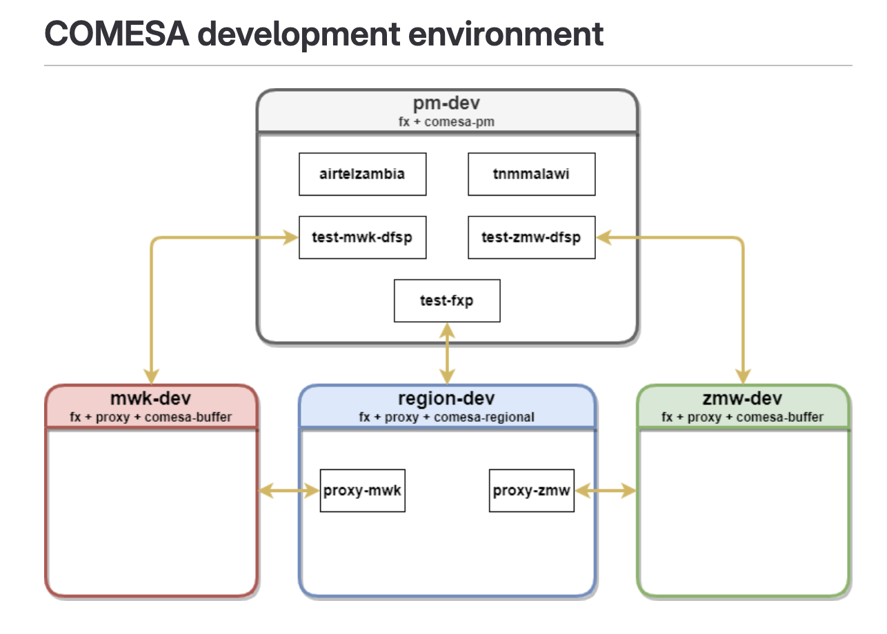

# comesa-tests

Repo for COMESA tests

## COMESA Environment setup

 

## Places to update when adding new tests

- [default.yaml](default.yaml) - update the `comesa-tests.namespaces` array
- [comesa-tests/kustomization.yaml](comesa-tests/kustomization.yaml) - update the
  `configMapGenerator[].files`

## Structure of the tests

The tests are structured in the following folders:

- [comesa-tests/collections/test-zmw-dfsp/payer.json](comesa-tests/collections/test-zmw-dfsp/payer.json)
  - These tests are run using TTK UI for test-zmw-dfsp
  - The tests cover the following scenarios:
    - `Payer` is `ZMW` and `Payee` is `MWK` : To test ZMW Outgoing amount
    - `Payer` is `ZMW` and `Payee` is `MWK` : To test MWK Incoming amount
- [comesa-tests/collections/test-mwk-dfsp/payer.json](comesa-tests/collections/test-mwk-dfsp/payer.json)
  - These tests are run using TTK UI for test-mwk-dfsp
  - The tests cover the following scenarios:
    - `Payer` is `MWK` and `Payee` is `ZMW` : To test MWK Outgoing amount
    - `Payer` is `MWK` and `Payee` is `ZMW` : To test ZMW Incoming amount

### 2. comesa_golden_path
